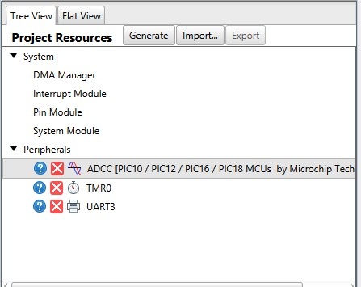
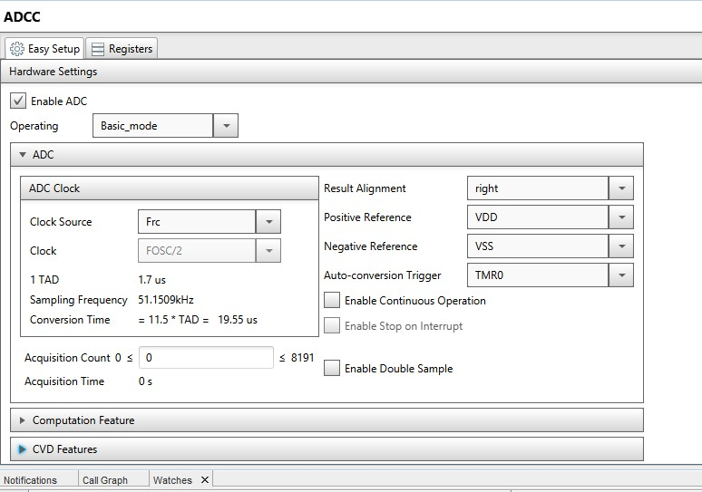
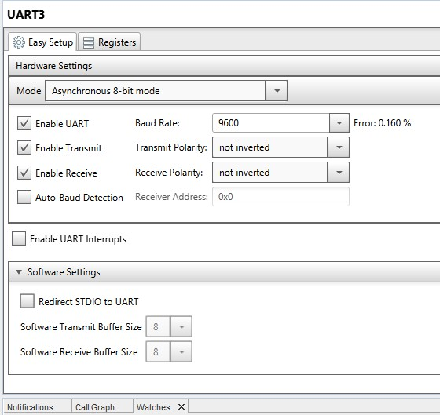
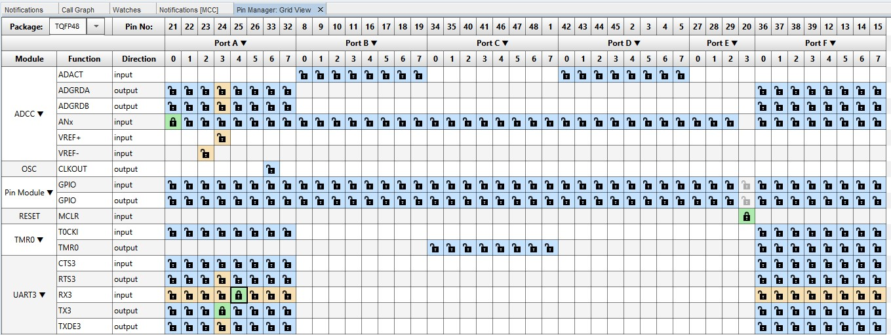
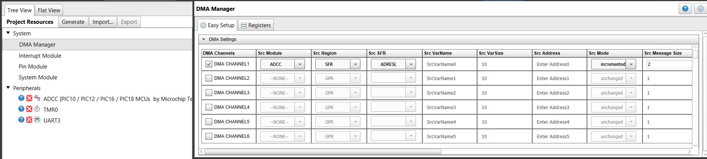
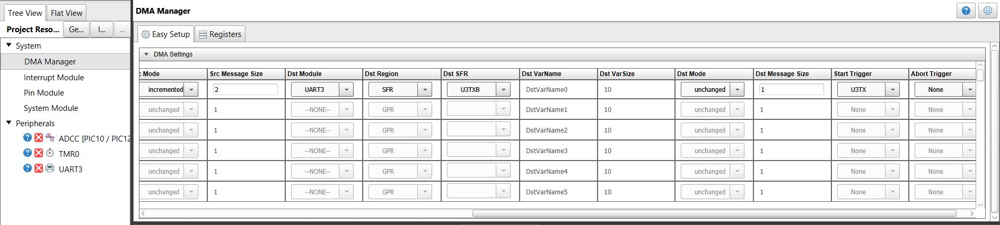
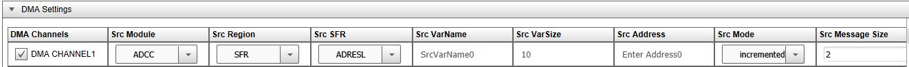
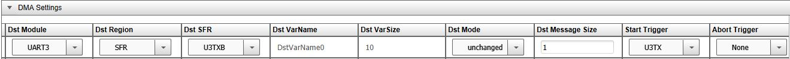
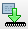

# Direct Memory Access on PIC MCUs [Part 1]:
This is **part 1 of 2** of an example showing how to set up [Direct Memory Access (DMA)](https://www.microchip.com/design-centers/8-bit/peripherals/core-independent/direct-memory-access?utm_campaign=PIC18FQ43&utm_source=GitHub&utm_medium=embeddedLink&utm_term=&utm_content=pic18f57q43-dma-adc-to-uart-part1-MMTCha) using the [Microchip Code Configurator (MCC)](https://www.microchip.com/Developmenttools/ProductDetails/DM164150?utm_campaign=PIC18FQ43&utm_source=GitHub&utm_medium=embeddedLink&utm_term=&utm_content=pic18f57q43-dma-adc-to-uart-part1-MMTCha) on the [PIC18F57Q43 Curiosity Nano](https://www.microchip.com/design-centers/8-bit/pic-mcus/device-selection/pic18f-q10-product-family?utm_campaign=PIC18FQ43&utm_source=GitHub&utm_medium=embeddedLink&utm_term=&utm_content=pic18f57q43-dma-adc-to-uart-part1-MMTCha) to transfer an Analog to Digital (ADC) conversion to a UART TX buffer with **zero lines of code and zero CPU utilization** using DMA.

[**Part 2**](https://github.com/microchip-pic-avr-examples/pic18f57q43-dma-uart-to-pwm-part2) covers how to set up the second device that utilizes DMA to transfer the contents of the received message in the UART RX buffer to a PWM module that will vary the brightness of an LED.

## Table of Contents
  - [Related Documentation](#related-documentation)
  - [Software Used](#software-used)
  - [Hardware Used](#hardware-used)
  - [Setup](#setup)
  - [Operation](#operation)
  - [Summary](#summary)
  - [Walkthrough](#walkthrough)

This example is extendable to the entire PIC18 Q43 family, as well as other 8-bit PIC devices with the DMA feature (ex. PIC18F K42).

The Timer (TMR0), Analog to Digital Converter with Computation (ADCC), and Universal Asynchronous Receiver Transmitter (UART3) and DMA on-chip peripherals are all used in this project (part1).

**This example is covered in a video format** [**linked here**](https://www.youtube.com/watch?v=Wz7gt11gpSw&t=1s).

## Related Documentation and Resouces
- **Videos**:
  - [DMA Overview on PIC® MCUs](https://www.youtube.com/watch?v=Lpru4TY-aHE)
  - [How to use DMA on 8 bit PIC MCUs](https://www.youtube.com/watch?v=Wz7gt11gpSw)
- **Tech Briefs** - Written briefs covering fundamentals
  - [TB3242: Configuring the DMA Peripheral](https://ww1.microchip.com/downloads/en/Appnotes/90003242A.pdf)
  - [TB3164: Direct Memory Access on 8-bit PIC® Microcontrollers](http://ww1.microchip.com/downloads/en/AppNotes/TB3164-Direct%20Memory-Access-on-8-bit-PIC-MCU-DS90003164B.pdf)
- **Application Notes** - Real-world use-cases
  - [AN3312: Arbitrary Waveform Generator Using DAC and DMA](https://www.microchip.com/00003312)
  - [AN3382: ADCC Context Switching Using DMA](https://microchip.com/00003382)
  - [AN3398: Building Hardware State Machines with CIPs](https://www.microchip.com/00003398)

## Software Used
All software used in this example is listed here:
- [MPLAB® X IDE 5.30](https://www.microchip.com/mplab/mplab-x-ide?utm_campaign=PIC18FQ43&utm_source=GitHub&utm_medium=embeddedLink&utm_term=&utm_content=pic18f57q43-dma-adc-to-uart-part1-MMTCha) or newer
- [MPLAB® XC8 2.10](https://www.microchip.com/mplab/compilers?utm_campaign=PIC18FQ43&utm_source=GitHub&utm_medium=embeddedLink&utm_term=&utm_content=pic18f57q43-dma-adc-to-uart-part1-MMTCha) or newer
- [MPLAB® Code Configurator (MCC) 3.95.0](https://www.microchip.com/mplab/mplab-code-configurator?utm_campaign=PIC18FQ43&utm_source=GitHub&utm_medium=embeddedLink&utm_term=&utm_content=pic18f57q43-dma-adc-to-uart-part1-MMTCha) or newer
  - [MPLAB® Code Configurator (MCC) Device Libraries PIC10 / PIC12 / PIC16 / PIC18 MCUs](https://www.microchip.com/mplab/mplab-code-configurator?utm_campaign=PIC18FQ43&utm_source=GitHub&utm_medium=embeddedLink&utm_term=&utm_content=pic18f57q43-dma-adc-to-uart-part1-MMTCha)
- [Microchip PIC18F-Q Series Device Support (1.4.109)](https://packs.download.microchip.com/?utm_campaign=PIC18FQ43&utm_source=GitHub&utm_medium=embeddedLink&utm_term=&utm_content=pic18f57q43-dma-adc-to-uart-part1-MMTCha) or newer

## Hardware Used
- PIC18F57Q43 Curiosity Nano [(DM164150)](https://www.microchip.com/Developmenttools/ProductDetails/DM164150?utm_campaign=PIC18FQ43&utm_source=GitHub&utm_medium=embeddedLink&utm_term=&utm_content=pic18f57q43-dma-adc-to-uart-part1-MMTCha)
  - NOTE: There is second one used in [**part 2**](https://github.com/microchip-pic-avr-examples/pic18f57q43-dma-uart-to-pwm-part2)
- Potentiometer (x1)
- **[Optional]** Curiosity Nano Base for Click boards™ [(AC164162)](https://www.microchip.com/Developmenttools/ProductDetails/AC164162?utm_campaign=PIC18FQ43&utm_source=GitHub&utm_medium=embeddedLink&utm_term=&utm_content=pic18f57q43-dma-adc-to-uart-part1-MMTCha) - this was only used in lieu of a breadboard.

## Setup
The hardware is setup as shown more closely [in this video](https://www.youtube.com/watch?v=Wz7gt11gpSw&t=1s). Below is a diagram where of the specific pins I used. You'll notice the Curiosity Nano Baseboard for clicks is missing from this diagram as they were really only used as breadboard-alternatives in this case.

### Connections

| Potentiometer | Q43 (part 1)      |               | Q43 (part 2)|
|---------------|-------------------|---------------|-------------|
|        +      |    3.3V           |               |             |
|       gnd     |    gnd            |               |             |
|   output      |    RA0            | (Yellow Wire) |             |             
|               |    RA3 (UART3 TX) | -----------> |    RA4 (UART3 RX)  |             |

## Operation

## Summary

As noted before - this is part 1 of 2 of an example showing how to set up [Direct Memory Access (DMA)](https://www.microchip.com/design-centers/8-bit/peripherals/core-independent/direct-memory-access?utm_campaign=PIC18FQ43&utm_source=GitHub&utm_medium=embeddedLink&utm_term=&utm_content=pic18f57q43-dma-adc-to-uart-part1-MMTCha) using the [Microchip Code Configurator (MCC)](https://www.microchip.com/mplab/mplab-code-configurator?utm_campaign=PIC18FQ43&utm_source=GitHub&utm_medium=embeddedLink&utm_term=&utm_content=pic18f57q43-dma-adc-to-uart-part1-MMTCha) on the [PIC18F57Q43 Curiosity Nano](https://www.microchip.com/Developmenttools/ProductDetails/DM164150?utm_campaign=PIC18FQ43&utm_source=GitHub&utm_medium=embeddedLink&utm_term=&utm_content=pic18f57q43-dma-adc-to-uart-part1-MMTCha) to transfer an Analog to Digital (ADC) conversion to a UART TX buffer without writing **any lines of code and zero CPU utilization** using DMA.

More generally, the technique detailed below shows the process of how one can:
- Use the DMA GUI provided in MCC
- Use the DMA to transfer memory from one special function register (SFR) to another SFR
- Specify hardware triggers that will initiate the above memory transfer

The goal here is to exemplify the usage of the GUI provided by MCC that will generate all the code we need. This means that **any device that has the DMA peripheral and is supported in MCC** can be similarly configured through the same methods. The section below details how to do this.

<!-- Summarize what the example has shown -->
## Walkthrough
[Back to Table of Contents](#table-of-contents)
<!-- Summarize what the example has shown -->
### Create New MPLAB X Project and Open MCC
1. Open the MPLAB X IDE
2. Create new project by clicking the icon:    
   1. Alternatively: file >> New Project
3. In **Choose Project** window
   1. Select **Microchip Embedded** category
   2. Select **Standalone Project**
   3. Hit **Next>**
4. In **Select Device** window
   1. Select **PIC18F57Q43** as your device
   2. Pro-tip: quickly filter for devices by inputting last 3-4 characters of the device and selecting from the drop-down list (e.g. Q43).
   3.  Hit **Next>**
5.  In **Select Tool (Optional)** window
    1.  If device is connected – select Microchip Kits -> PIC18F57Q43 Curiosity Nano (PKOB nano)
    2.  If not, you can do this later when programming the device.
    3.  Hit **Next>**
6.  In **Select Compiler** window
    1.  Select XC8 (v2.10)
    2.  Hit **Finish**
7.  Open MCC by clicking the icon in the toolbar 

### Configure MCC
1. In **System Module** window
   1. Set **Oscillator Select** to **HFINTOSC**

2. Under **Device Resources** in left-hand pane
   1. Open the **Peripherals** drop-down
   2. Double-click the (PIC10/PIC12/…) instance of the **ADCC [PIC10/…]**, **TMR0** and **UART3** peripherals to add them your project.

3. In **TMR0** window/tab
   1. Select **FOSC/4** for **Clock Source**
   2. Set **Clock pre-scaler** to **1:64**
   3. Set **Requested Period** to **50 ms**
   4. **What we just did** – configured the TMR0 to overflow every ~50ms. You can mess around with the clock source, system clock, and post/pre-scalars to change the % error or the range of acceptable inputs to for the timer period.

4. In **ADCC** window/tab
   1. Set **Clock Source** to **FRC**
   2. Set **Auto-Conversion Trigger** to **TMR0**
   3. **What we just did** – changed the clock source to the internal ADC RC oscillator circuit (i.e. FRC), and set up the ADC to get a conversion every time a rising edge is detected from TMR0.

5. In the **UART** window/tab
   1. Set **Baud Rate** to **9600**

6. In the **Pin Manager: Grid View** window
   1. UART3 TX3 --> A3
   2. UAR3 RX3 --> A4 (not needed necessarily since we are just transmitting)
   3. ADCC ANx --> A0

7. In the **DMA Manager** window 

  

  

**Zoomed in pictures and additional table below are included for clarity** 

  

  

|     | Module | Region | SFR    | VarName | VarSize | Address | Mode      | Message Size | Start Trigger | Abort Trigger |
|-----|--------|--------|--------|---------|---------|---------|-----------|--------------|---------------|---------------|
| Src | ADCC   | SFR    | ADRESL | -       | -       | -       | increment | 2            | U3TX          | None          |
| Dst | UART3  | SFR    | U3TXB  | -       | -       | -       | unchanged | 1            | U3TX          | None          |

1. Enable **DMA Channel1**
   1. What we just did:
      1. **ADCC** is the **source module** of the DMA channel
      2. **ADRESL** is the **SFR region** that we want data to be sourced from
      3. **Mode** must be **incremented** so that we can get the value from ADRESH, which is directly above ADRESL according to the SFR Memory Map.
      4. **Message size** is basically **how many bytes** are coming from the source module. The ADC result register is a *16-bit register*, so the **message size is 2-bytes**.
      5. Similarly, the UART TX Buffer is 1-byte, so we need to indicate that it can only handle one byte at a time. (i.e. message size = 1)
      6. Set the DMA **start trigger** to fire every time TX Buffer is empty (**U3TXB**). At this point you might wonder – why don’t I just set the trigger for every time there is an ADC conversion? You are certainly given the flexibility to do so by setting Start Trigger to AD. I encourage you to try and see what happens.
         1. **Spoiler Alert:** In many cases you will find that there is garbage data being transmitted from the UART. The reason for this is that depending on the relative speed of the UART, the DMA might be overwriting the buffer before the bits are shifting out. The DMA has no knowledge of this information, it’s simply a messenger.
2. Hit **Generate Project** and
3.  Hit **Program the device**

## Conclusion:

You have finished part 1, now you can either check out the results by using a logic analyzer, oscilloscope, or even a serial terminal like the Data Visualizer plugin or standalone application. Next, [**check out part 2**](https://github.com/microchip-pic-avr-examples/pic18f57q43-dma-uart-to-pwm-part2) to complete the application.

[Back to Table of Contents](#table-of-contents)
